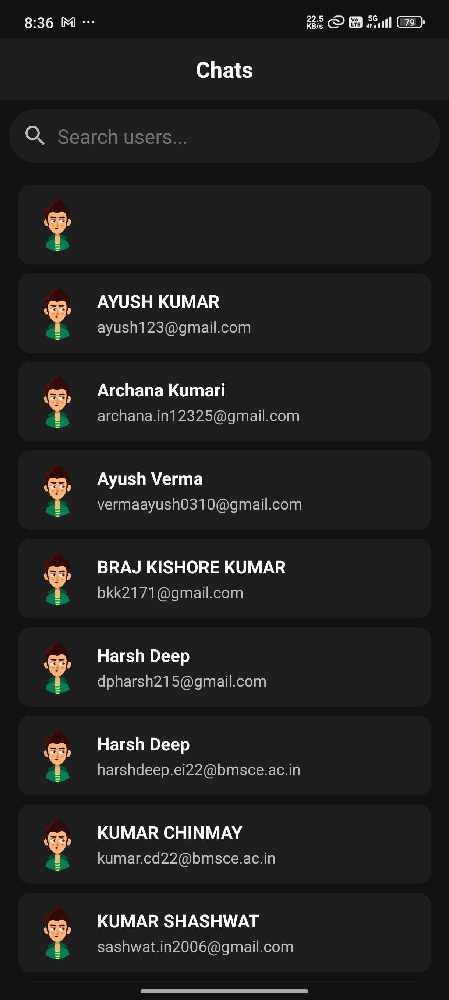
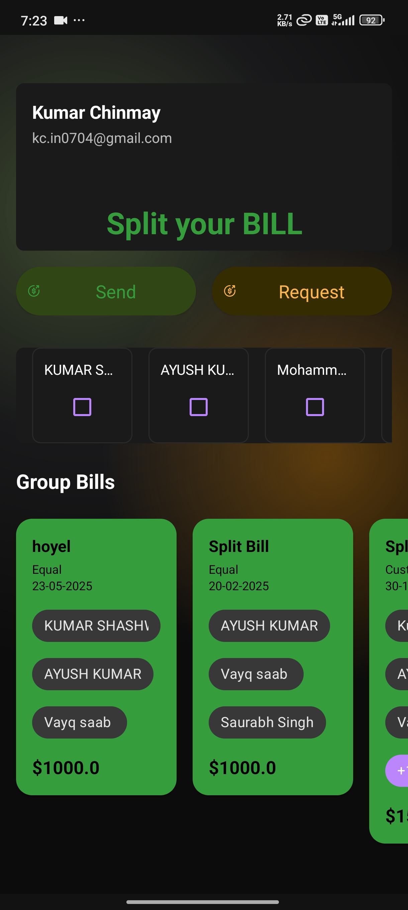

# 🚀 **BillBuddy**
### _Your Smart Bill & Expense Manager_

---

> **BillBuddy** helps you manage your expenses, split bills, chat, and track your spending with ease.  
> _Stay on top of your finances, anytime, anywhere!_

---

## 📑 Table of Contents
- [App Preview](#app-preview)
- [Features](#features)
- [Tech Stack](#tech-stack)
- [Permissions](#permissions)
- [Project Structure](#project-structure)
- [Installation](#installation)
- [Usage](#usage)
- [FAQ](#faq)
- [Contributing](#contributing)
- [License](#license)

---

## 📱 App Preview

### Profile & Dashboard


### Card & Transactions


### Chat
<!-- Add chat screenshot here -->


### Split Bill
<!-- Add split bill screenshot here -->


---

## ✨ Features

- 🔐 **User Authentication:** Secure login and signup
- 👤 **Profile Management:** View and edit your profile
- 🏦 **Dashboard:** Overview of your balance, cards, and recent transactions
- 💬 **Chat:** In-app chat with your bill buddies
- 💸 **Split Bills:** Easily split expenses with friends and track who owes what
- 📊 **Expense Tracking:** Add, view, and categorize expenses
- 📅 **Transaction History:** Detailed list of all transactions
- 📈 **Reports:** Visualize your spending and savings
- 📞 **Video Calling:** Connect with friends for bill discussions
- ⚙️ **Settings:** Customize your app experience
- 👨‍💻 **Developer Info:** Meet the creators
- 🎨 **Modern, intuitive UI:** Clean and user-friendly design

---

## 🧰 Tech Stack
- **Language:** Kotlin
- **Framework:** Android SDK
- **Architecture:** MVVM (Model-View-ViewModel)
- **Build System:** Gradle
- **UI:** XML Layouts, Custom Adapters, RecyclerView
- **Other:** Custom Drawables, Fonts, Animations

---

## 🔒 Permissions
BillBuddy requests the following permissions for full functionality:
- `INTERNET` - For chat, sync, and updates
- `RECORD_AUDIO` - For video calls
- `CAMERA` - For video calls
- `MODIFY_AUDIO_SETTINGS` - For call quality
- `ACCESS_WIFI_STATE`, `ACCESS_NETWORK_STATE` - For connectivity
- `BLUETOOTH` - For device communication
- `READ_PHONE_STATE` - For call management
- `READ_EXTERNAL_STORAGE`, `READ_MEDIA_IMAGES` - For profile and chat images

---

## 🗂 Project Structure
```
BillBuddy/
├── app/
│   ├── src/
│   │   └── main/
│   │       ├── java/com/example/billbudddy/   # Main source code
│   │       │   ├── Adapter/                   # RecyclerView adapters
│   │       │   ├── Domain/                    # Domain models
│   │       │   ├── Repository/                # Data repositories
│   │       │   ├── ViewModel/                 # ViewModels (MVVM)
│   │       │   ├── models/                    # Data models
│   │       │   ├── util/                      # Utilities
│   │       │   └── ...                        # Activities, features
│   │       ├── res/                           # Layouts, drawables, values
│   │       └── AndroidManifest.xml            # App manifest
│   └── build.gradle                           # App-level Gradle config
├── build.gradle                               # Project-level Gradle config
└── ...
```

---

## 🛠️ Installation

### Prerequisites
- Android Studio (latest recommended)
- Android SDK
- JDK 8 or higher

### Steps
```bash
# 1. Clone the repository
git clone https://github.com/kumarchinmay0704/Billbuddy-.git

# 2. Open in Android Studio
#    File > Open > Select the cloned folder

# 3. Let Gradle sync and download dependencies

# 4. Connect your Android device or start an emulator

# 5. Run the app (Shift+F10 or click the Run button)
```
> **Note:**  
> All third-party connections (APIs, keys) are ignored in this public repo for security.

---

## 📚 Usage
- **Login/Signup:** Start by creating an account or logging in.
- **Dashboard:** View your balance, cards, and recent transactions.
- **Profile:** Manage your personal info and settings.
- **Chat:** Communicate with friends about bills and expenses.
- **Split Bill:** Create and manage group expenses, track who owes what.
- **Expense Tracking:** Add, edit, and categorize your expenses.
- **Reports:** Visualize your spending patterns.
- **Video Call:** Start a call for bill discussions.
- **Settings:** Customize notifications, privacy, and more.

---

## ❓ FAQ
**Q: Why does the app need so many permissions?**  
A: Permissions are required for chat, video calls, and managing images securely.

**Q: How do I reset my password?**  
A: Use the 'Forgot Password' option on the login screen (if implemented).

**Q: Can I use BillBuddy offline?**  
A: Some features require internet connectivity (chat, sync, video calls).

---

## 🤝 Contributing
1. Fork this repo
2. Create your feature branch (`git checkout -b feature/AmazingFeature`)
3. Commit your changes (`git commit -m 'Add some AmazingFeature'`)
4. Push to the branch (`git push origin feature/AmazingFeature`)
5. Open a Pull Request

---

## 📄 License
Distributed under the MIT License. See `LICENSE` for more information.

---

> _Made with ❤️ by Kumar Chinmay_ 
