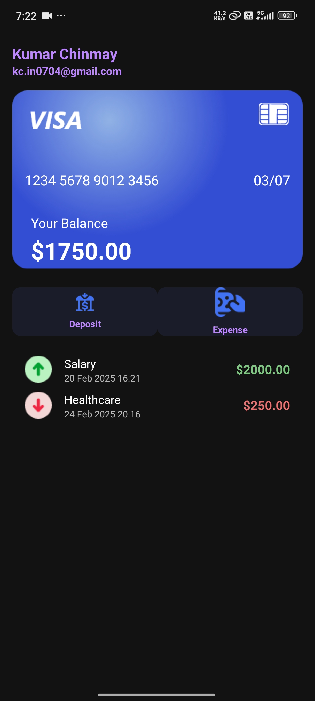

# 🚀 **BillBuddy**
### _Your Smart Bill & Expense Manager_

---

> **BillBuddy** helps you manage your expenses, split bills, and track your spending with ease.  
> _Stay on top of your finances, anytime, anywhere!_

---

## 📱 **App Preview**

### **Profile & Dashboard**


### **Card & Transactions**


<!--
### **Live Demo**

-->

---

## ✨ **Features**

- 🔍 **Chat** with your bill buddy
- 💸 **Split Bills** easily with friends
- 📊 **Track Expenses** in real-time
- 🏦 **Deposit & Expense** management
- 🔐 **Secure Logout**
- 🎨 **Modern, intuitive UI**

---

## 🛠️ **Installation**

```bash
# 1. Clone the repository
git clone https://github.com/kumarchinmay0704/Billbuddy-.git

# 2. Navigate to the project directory
cd Billbuddy-

# 3. Install dependencies
npm install

# 4. Start the app
npm start
```

> **Note:**  
> All third-party connections (APIs, keys) are ignored in this public repo for security.

---

## 📚 **Usage**

- **Home:** View your dashboard and quick stats
- **Profile:** Manage your account and settings
- **Support:** Get help and support
- **Settings:** Customize your experience

---

## 🧰 **Tech Stack**

- React Native / Flutter (specify your framework)
- Node.js (if backend)
- [Add any other major libraries]

---

## 🤝 **Contributing**

1. Fork this repo
2. Create your feature branch (`git checkout -b feature/AmazingFeature`)
3. Commit your changes (`git commit -m 'Add some AmazingFeature'`)
4. Push to the branch (`git push origin feature/AmazingFeature`)
5. Open a Pull Request

---

## 📄 **License**

Distributed under the MIT License. See `LICENSE` for more information.

---

> _Made with ❤️ by Kumar Chinmay_ 